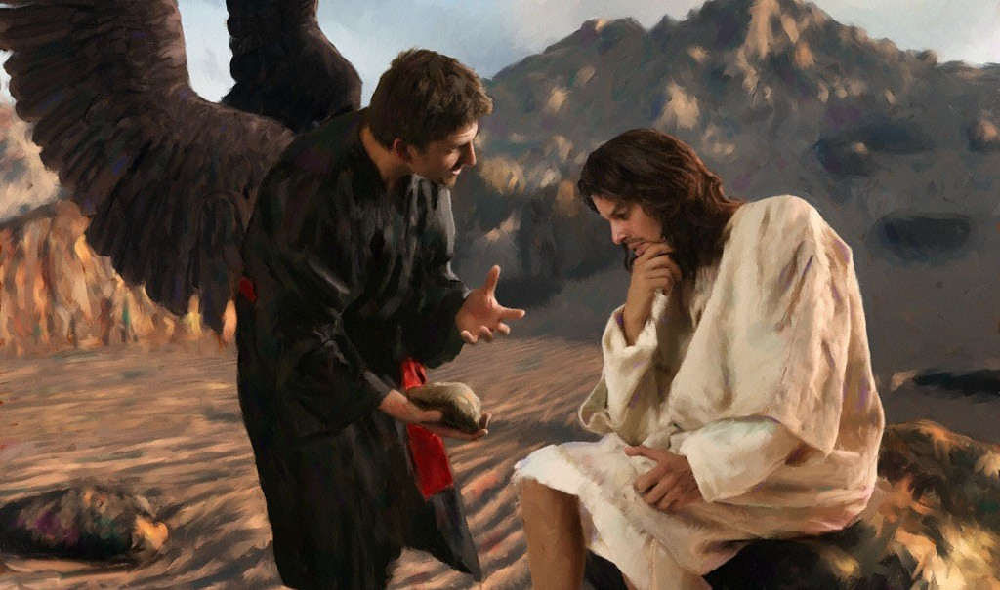

Começamos o tempo da quaresma e a liturgia do **1º Domingo da Quaresma** nos apresenta a tentação do diabo a Jesus no deserto. E também nos apresenta leituras sobre o pecado original que trouxe a morte para a humanidade.

Para melhor refletirmos sobre este evangelho, precisamos situá-lo no tempo.

Após o batismo de Jesus no rio Jordão, a Palavra diz que o Espírito O conduziu ao deserto para Jejuar por quarenta dias e quarenta noites e ser tentado.

Isto nos mostra que todas as vezes que recebermos uma graça de Deus, nós devemos nos preparar para sermos tentados.

E uma vez que fomos agraciados pelo Batismo. Nós devemos estar constantemente preparados para a tentação.

O tempo da quaresma é o tempo em quem a igreja nos ensina e nos recorda que devemos nos preparar para as tentações.

Observe que a mãe igreja usa este tempo para nos ensinar, entretanto nós devemos nos preparar para as tentações todos os dias de nossa vida, embora na quaresma nós intensificamos esta preparação.

Nós começamos a quaresma na quarta-feira de cinzas lendo na segunda leitura que agora é o tempo **favorável**. Agora é a nossa grande oportunidade para aprendermos e intensificarmos a nossa preparação para conseguirmos resistir às tentações do diabo.

Jesus foi conduzido ao deserto para ser tentado. O deserto é um lugar de provação, é onde amadurecemos a nossa vocação, onde nos aproximamos de Deus, que nos deu a vida.

A primeira leitura diz que Deus formou o homem do pó da terra. O verbo utilizado para descrever a ação de Deus é o verbo *"yasar"* que é um verbo técnico ligado ao trabalho do oleiro e significa "formar", "modelar".

Para o pó da terra ser "modelado" pelo oleiro ele precisa ser molhado, ele precisa se tornar barro. E é a água do batismo que nos molha e nos transforma em barro para sermos modelados por Deus.

Deus nos modelou e nos deu a vida para vivermos felizes em comunhão com Ele.

Entretanto, quando nos fechamos em nós mesmos, nos achando autossuficientes, nós nos afastamos de Deus e abraçamos a morte.

Mas Deus é misericordioso e nos chama de novo para a vida plena em felicidade. Ele nos chama à conversão. Nos chama para sairmos das trevas e voltarmos à comunhão com Ele.

A segunda leitura nos apresenta as nossas duas opções de vida. Podemos ser como Adão que se afasta de Deus e caminha para a morte. Ou podemos ser como Jesus que vive a obediência e a plena comunhão com o Pai.

São Paulo nos diz que: Se a morte entrou no mundo pela desobediência de Adão e Eva. De modo bem superior a graça de Deus foi derramada em abundancia sobre nós através de Jesus Cristo.

O tempo da quaresma é este tempo favorável à conversão onde a igreja nos ensina a saírmos da nossa vida de Adão que gera a morte e seguirmos em direção à Jesus Cristo para vida eterna.

Não deixe esta oportunidade passar.

Se for tocar/cantar na missa deste **1º domingo da quaresma**, clique no link abaixo para conferir as nossas sugestões de músicas.

**[\>> Sugestões de música para a missa do 1º domingo da quaresma](https://musicasparamissa.com.br/sugestoes-para/1o-domingo-da-quaresma-ano-a/)**{:target=_blank}

E se for cantar o salmo, também gravamos uma melodia que pode te ajudar, confira aqui:

**[\>> Melodia para o SALMO 50 - PIEDADE Ó SENHOR TENDE PIEDADE POIS PECAMOS CONTRA VÓS](https://musicasparamissa.com.br/musica/salmo-50-piedade-o-senhor-tende-piedade-pois-pecamos/)**{:target=_blank}

Uma santa e abençoada quaresma para você e sua família.

Gustavo
